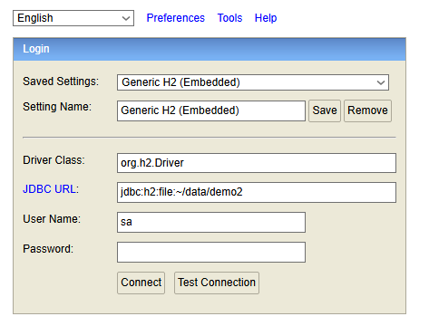

#  E-commerce Product Management System


## Tech Stack
**Java**

21

**Spring Boot**

3.5.13

**Database**

H2 (In-Memory)

**Migration**

Liquibase

**Build Tool**

Maven

----------

##  Getting Started

### Prerequisites

-   JDK 21 installed.

-   Maven installed (or use the provided `./mvnw`).

-   An IDE (IntelliJ IDEA recommended).


### Installation & Setup

1.  **Clone the project:**

    Choose `File > New > Project From Version Control` in your IDE and paste the link:
    ```
    https://github.com/BulandaK/ecommerce.git
    ```


----------

##  Database & Testing Data

The project uses an **H2 In-Memory Database** for easy development and testing.

### H2 Console Access

-   **URL:** `http://localhost:8080/h2-console`

-   **Credentials:** As shown in the image below. (or you can check in application.properties)
    

### Dummy Data

After connecting to the console, paste this dummy data to test our enpoints:

```
INSERT INTO producers (name, description) VALUES ('Samsung', 'South Korean multinational electronics corporation');

INSERT INTO producers (name, description) VALUES ('Apple', 'American multinational technology company');

INSERT INTO producers (name, description) VALUES ('Sony', 'Japanese multinational conglomerate corporation');

  

INSERT INTO products (name, price, producer_id) VALUES ('Samsung Galaxy S24', 3999.99, 1);

INSERT INTO products (name, price, producer_id) VALUES ('Samsung 4K TV 55"', 2499.99, 1);

INSERT INTO products (name, price, producer_id) VALUES ('iPhone 15 Pro', 5499.99, 2);

INSERT INTO products (name, price, producer_id) VALUES ('Sony PlayStation 5', 2299.99, 3);

  

INSERT INTO product_attributes (attribute_key, attribute_value, product_id) VALUES ('color', 'Phantom Black', 1);

INSERT INTO product_attributes (attribute_key, attribute_value, product_id) VALUES ('ram', '12GB', 1);

INSERT INTO product_attributes (attribute_key, attribute_value, product_id) VALUES ('storage', '256GB', 1);

INSERT INTO product_attributes (attribute_key, attribute_value, product_id) VALUES ('screen_size', '55 inches', 2);

INSERT INTO product_attributes (attribute_key, attribute_value, product_id) VALUES ('resolution', '3840x2160', 2);

INSERT INTO product_attributes (attribute_key, attribute_value, product_id) VALUES ('chip', 'Apple A17 Pro', 3);

INSERT INTO product_attributes (attribute_key, attribute_value, product_id) VALUES ('storage', '128GB', 3);

INSERT INTO product_attributes (attribute_key, attribute_value, product_id) VALUES ('storage', '825GB SSD', 4);

INSERT INTO product_attributes (attribute_key, attribute_value, product_id) VALUES ('ram', '16GB', 4);

```

----------

## API Endpoints

### 1. Get All Products

`GET http://localhost:8080/api/products`

Retrieves a paginated and filterable list of products.

**Query Examples:**

-   **Basic Pagination:** `?page=0&size=10`

-   **By Name:** `?name=samsung`

-   **Price Range:** `?priceFrom=1000&priceTo=5000`

-   **Combined with Sort:** `?name=samsung&priceFrom=1000&sort=price,desc`


----------

### 2. Create Product

`POST http://localhost:8080/api/products`

Adds a new product to the catalog.

**Request Body:**

JSON

```
{
  "name": "Samsung Galaxy S25",
  "price": 4999.2,
  "producerId": 1,
  "attributes": [
    {
      "attributeKey": "color",
      "attributeValue": "Titanium Gray"
    }
  ]
}

```

----------

### 3. Update Product

`PUT http://localhost:8080/api/products/{id}`

Updates existing product details.

**Request Body:**

JSON

```
{
  "name": "Samsung Galaxy S24 Ultra",
  "price": 4999.99,
  "producerId": 1,
  "attributes": [
    { "attributeKey": "color", "attributeValue": "Titanium Black" },
    { "attributeKey": "storage", "attributeValue": "512GB" }
  ]
}

```

----------

### 4. Delete Product

`DELETE http://localhost:8080/api/products/{id}`

Removes a specific product from the database.


